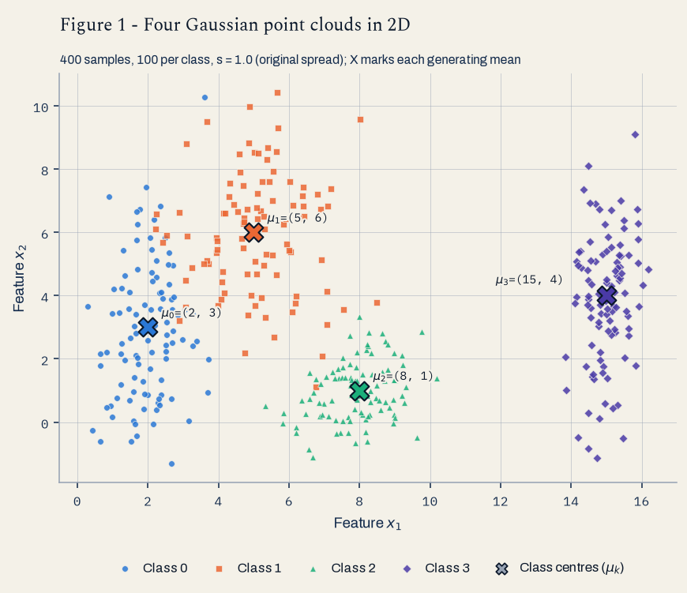
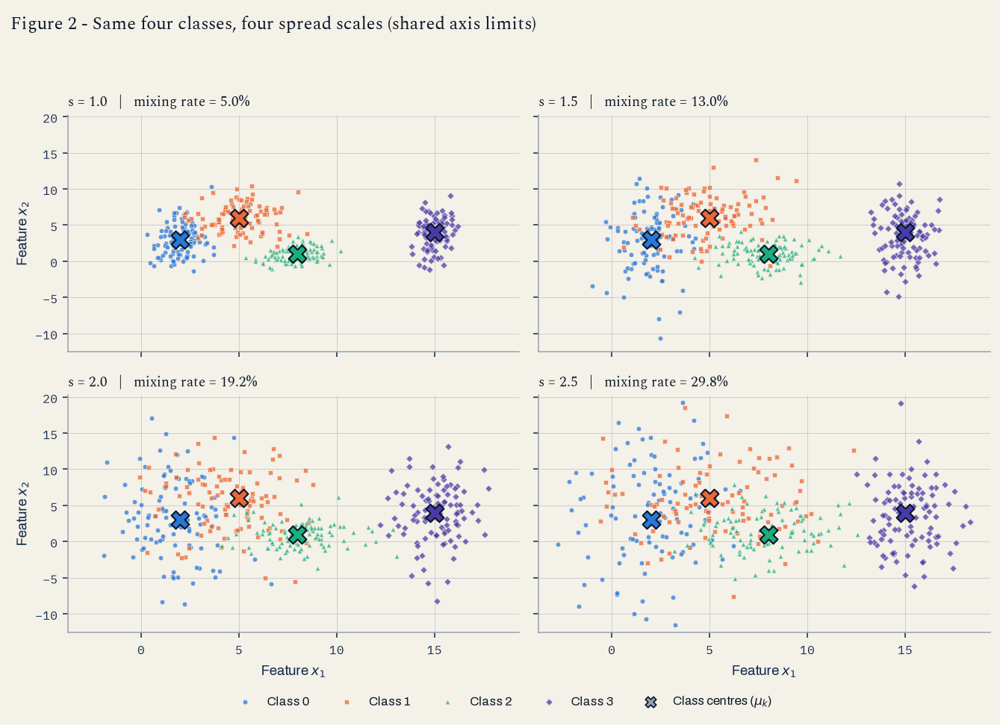
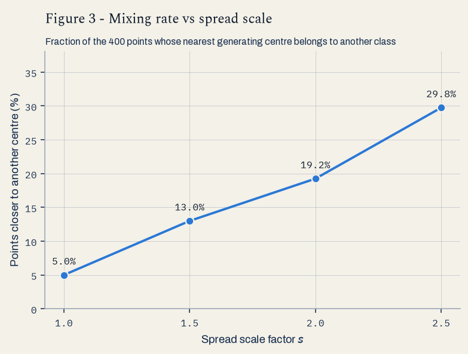
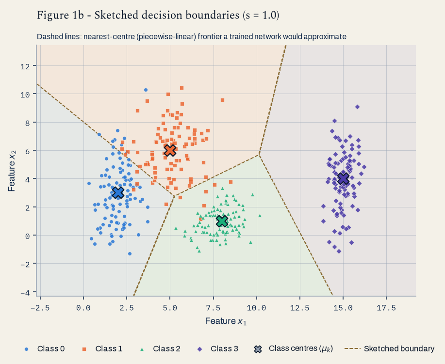
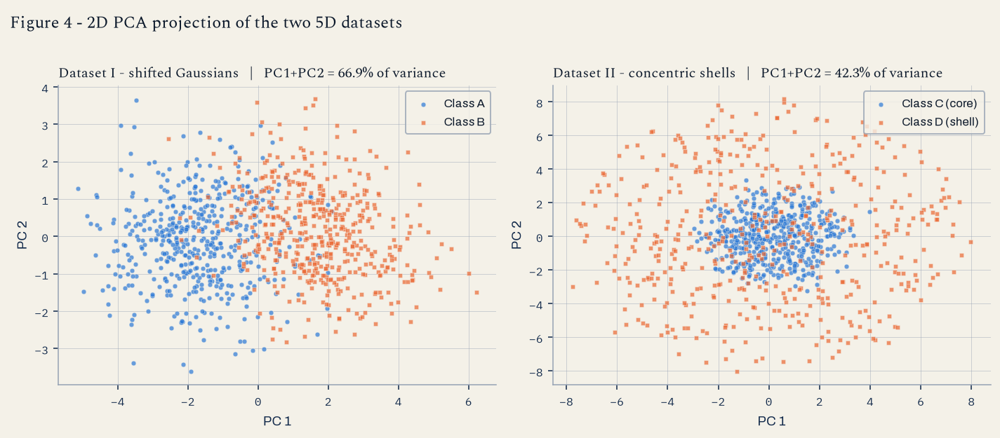
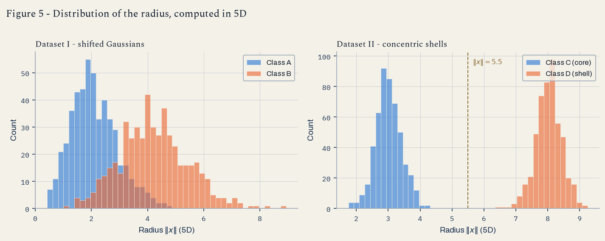
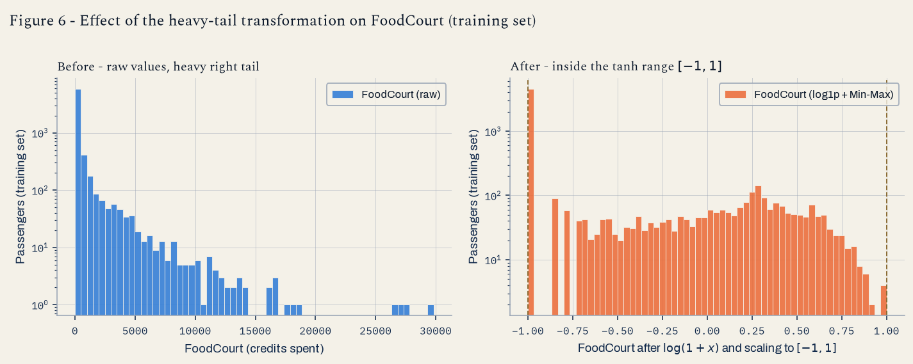

# Activity 1 — Data Preparation and Analysis for Neural Networks

<p class="eyebrow">Insper · Artificial Neural Networks and Deep Learning · Individual</p>

The thread through the three exercises is the **spread of the data**: how far a point
cloud spreads, in which direction, and how that changes the difficulty of the
classification problem a network would have to solve.

<div class="kpi">
  <div><span class="k">Mixing rate, s = 1</span><span class="v">5.00%</span></div>
  <div><span class="k">Mixing rate, s = 2.5</span><span class="v">29.75%</span></div>
  <div><span class="k">Smallest S, s = 1</span><span class="v">1.3258</span></div>
  <div><span class="k">‖c<sub>C</sub> − c<sub>D</sub>‖, Dataset II</span><span class="v">0.3535</span></div>
  <div><span class="k">Final train matrix</span><span class="v">(6954, 17)</span></div>
</div>

## Approach and reproducibility

* **Exercise 1** measures the geometry of four 2D Gaussian clouds and how the picture
  degrades when every standard deviation is multiplied by a factor \(s\). Two purely
  geometric statistics carry the argument: the **separation ratio** of each class pair
  and the **mixing rate** (fraction of points whose nearest class centre is not their own).
* **Exercise 2** contrasts two 5D datasets with the same dimensionality but different
  structure — shifted Gaussians versus concentric spherical shells — and shows that a
  measure computed *in 5D* (the radius) can separate what a linear 2D projection cannot.
* **Exercise 3** takes the Kaggle **Spaceship Titanic** data and builds a leakage-free
  preprocessing pipeline whose output is on the scale a `tanh` hidden layer expects.

!!! info "Reproducibility"
    One generator instance, `rng = np.random.default_rng(42)`, is created in
    `src/run_report.py` and threaded through Exercises 1 and 2 in that order;
    Exercise 3 uses the same seed (`42`) for the stratified split. Running
    `python src/run_report.py` rewrites all six figures and every table on this page —
    the numbers quoted in the text are the ones the script prints, not hand-copied
    values. Libraries: `numpy`, `pandas`, `matplotlib`, `scikit-learn`
    (PCA and preprocessing only — **no model is trained anywhere in this activity**).

**Figure conventions.** Every figure has a title, axis labels and a class legend.
Classes always keep the same colour *and* the same marker shape (circle, square,
triangle, diamond), so identity never depends on colour alone; the four hues were
checked for colour-vision-deficiency separation against the page background.

---

## Exercise 1 — Point clouds: geometry and spread in 2D

### A — Generate the clouds

400 samples in total, 100 per class, each class an axis-aligned Gaussian with the
parameters given in the statement:

```python title="src/ex1_point_clouds.py — class parameters"
--8<-- "src/ex1_point_clouds.py:params"
```

```python title="src/ex1_point_clouds.py — generating the clouds"
--8<-- "src/ex1_point_clouds.py:generate"
```

<figure markdown="span">
  
  <figcaption>Figure 1 — The four clouds at the original spread (s = 1.0). The X markers are the
  generating means; their coordinates are printed next to them.</figcaption>
</figure>

Reading Figure 1: **class 3** sits alone on the right (its mean is at \(x_1 = 15\), far from
everything else) and is stretched vertically because its standard deviation is
\((0.5, 2.0)\) — narrow in \(x_1\), wide in \(x_2\). **Class 2** is the only isotropic cloud
(\(0.9, 0.9\)) and forms a compact blob. **Classes 0 and 1** are both wide in \(x_2\)
(\(2.5\) and \(1.9\)) and their means are only \(4.24\) apart, so they already touch at the
original spread — that pair is the whole story of item B.

### B — More or less spread out

The same four classes were generated four times, multiplying **every** standard deviation
by \(s \in \{1.0, 1.5, 2.0, 2.5\}\) and leaving the means untouched: four datasets of four
classes each, not one dataset with four different classes.

<figure markdown="span">
  
  <figcaption>Figure 2 — The same four classes at s = 1.0, 1.5, 2.0 and 2.5, on shared axis limits
  so the comparison is honest. Each subplot title carries its mixing rate.</figcaption>
</figure>

#### Separation ratio at s = 1

For a pair of classes \((i, j)\) the separation ratio is

\[
S_{ij} \;=\; \frac{\lVert \mu_i - \mu_j \rVert}{\sigma_i + \sigma_j},
\qquad
\sigma_i \;=\; \tfrac{1}{2}\left(\sigma_i^{(1)} + \sigma_i^{(2)}\right)
\]

that is, the distance between the two centres divided by the sum of the two spreads,
where each cloud is summarised by the mean of its two per-feature standard deviations.
High values mean well-separated clouds; low values mean clouds that blend into each other.

```python title="src/ex1_point_clouds.py — separation ratio and mixing rate"
--8<-- "src/ex1_point_clouds.py:metrics"
```

--8<-- "results/tbl_ex1_separation.md"

The **smallest** ratio is \(S_{01} = 1.3258\) — classes **0 and 1**, exactly the pair that
already looks glued together in Figure 1. Because the means never change and every
\(\sigma\) is multiplied by \(s\), the ratio is exactly proportional to \(1/s\):
\(S_{ij}(s) = S_{ij}(1)/s\). So without generating anything new, at \(s = 2.5\) the smallest
ratio becomes

\[
S_{01}(2.5) \;=\; \frac{1.3258}{2.5} \;=\; \mathbf{0.5303}.
\]

A ratio below \(1\) means the two centres are closer to each other than the clouds are
wide — the two point clouds necessarily interpenetrate.

#### Mixing rate

The mixing rate is the fraction of points whose **nearest class centre** (among the four
generating means, Euclidean distance) is not the centre of their own class. It is purely
geometric: a `(400, 4)` distance matrix, an `argmin`, and a comparison — nothing is trained.

--8<-- "results/tbl_ex1_mixing.md"

<figure markdown="span">
  
  <figcaption>Figure 3 — Mixing rate versus spread scale factor s. Each point is labelled with its
  value; the growth is close to linear over this range.</figcaption>
</figure>

#### From which scale factor can the clouds no longer be separated by straight lines?

**From \(s = 1.5\) onwards.** The criterion is the smallest separation ratio crossing \(1\):

| \(s\) | \(S_{01}(s)\) | Mixing rate | Reading |
|---|---|---|---|
| 1.0 | 1.3258 | 5.00% | Centres farther apart than the clouds are wide; straight lines still work, with a thin band of errors between classes 0 and 1 |
| 1.5 | 0.8839 | 13.00% | \(S_{01} < 1\): the clouds interpenetrate — no straight line separates 0 from 1 without a double-digit error rate |
| 2.0 | 0.6629 | 19.25% | Classes 0, 1 and 2 form one continuous mass in Figure 2 |
| 2.5 | 0.5303 | 29.75% | Nearly one point in three is closer to a foreign centre |

At that point the smallest ratio has dropped **below 1** (\(0.8839\) at \(s = 1.5\)), and it
keeps falling as \(1/s\) — reaching \(\mathbf{0.5303}\) at \(s = 2.5\), i.e. the distance
between the centres of classes 0 and 1 is only about half the sum of their spreads. Note
what does *not* change: class 3 stays separable by a single vertical line at every scale
tested (\(S_{03} = 4.50\) at \(s = 1\), still \(1.80\) at \(s = 2.5\)). Loss of linear
separability is a *pairwise* property, and here it is driven entirely by the 0–1 pair.

### C — Analysis

#### Overlap at s = 1 and what a linear boundary can do

At the original spread the four clouds are **not** equally hard:

* **classes 0 and 1** overlap in a band around \(x_1 \approx 3\!-\!5\), \(x_2 \approx 4\!-\!7\);
  this is where the 5% mixing rate (20 of 400 points) comes from;
* **classes 1 and 2** brush against each other near \((6.5, 2.5)\) — \(S_{12} = 2.38\);
* **class 3** is isolated (\(S_{03} = 4.50\), \(S_{13} = 3.64\), \(S_{23} = 3.54\)).

**Could a single linear boundary separate all classes?** No — and for two independent
reasons. First, a single hyperplane in \(\mathbb{R}^2\) cuts the plane into exactly two
half-planes, so it can express at most a 2-class decision; four classes need at least
\(\lceil \log_2 4 \rceil = 2\) and in practice 3 frontiers arranged as a partition.
Second, even for the easiest binary sub-problem the classes are only *almost* separable:
the 0–1 overlap means any single line leaves points of both classes on the wrong side.

**A set of linear boundaries?** Yes, essentially. Three straight lines arranged as a
piecewise-linear partition (one separating class 3 on the right, one separating class 2
below, one splitting the 0–1 pair diagonally) classify the great majority of the 400
points correctly. That is exactly what a small network with a couple of hidden units
implements: a composition of linear frontiers, each one a hidden unit, glued into a
piecewise-linear partition by the output layer.

#### Sketched decision boundaries

<figure markdown="span">
  
  <figcaption>Figure 1b — Boundaries a trained network could be expected to learn, sketched on
  Figure 1: the nearest-centre (Voronoi) partition of the four means. Dashed champagne hairlines
  are the frontiers; the faint fills show which region belongs to which class.</figcaption>
</figure>

The sketch is the **nearest-centre partition** of the four means: the piecewise-linear
frontier a network approximates when the clouds have comparable spreads. It is consistent
with the plotted data — every frontier runs through the empty corridor between two clouds —
and its error is exactly the 5% mixing rate, because "misclassified by the nearest-centre
rule" and "counted in the mixing rate" are the same event by construction. A real trained
network would tilt the 0–1 frontier slightly (class 0 is wider in \(x_2\), so the optimal
boundary bends toward the tighter cloud), but the topology of the sketch would not change.

#### The more spread out the clouds, the wider the region of unavoidable error

Comparing the sketch with item B: the frontiers in Figure 1b are **fixed** by the means,
which never move — but the clouds grow through them. As \(s\) increases, the overlap region
where points of two classes coexist widens, so the fraction of points sitting on the wrong
side of *any* possible boundary grows: 5.00% → 13.00% → 19.25% → 29.75%. This error is
irreducible: it is a property of the data-generating distributions, not of the model, so no
architecture, no amount of training and no extra data removes it. A more flexible network
can only bend the frontier to match the local class posterior; where the two densities
genuinely cross, the best any classifier can do is pick the locally more likely class and
accept the rest as loss. Practically, that is the difference between an error rate a model
can fix (wrong shape of boundary) and one it cannot (overlapping classes) — and the mixing
rate is a cheap upper-bound-style estimate of the second, computed before any training.

---

## Exercise 2 — Non-linearity in higher dimensions

Two datasets, both in \(\mathbb{R}^5\), both with 500 samples per class — same size, same
dimensionality, completely different structure.

```python title="src/ex2_nonlinearity.py — parameters of both datasets"
--8<-- "src/ex2_nonlinearity.py:params"
```

### A — Dataset I: shifted Gaussians

```python title="src/ex2_nonlinearity.py — Dataset I"
--8<-- "src/ex2_nonlinearity.py:dataset1"
```

The two classes differ in **location and in shape**: \(\Sigma_B\) has larger variances
(\(1.5\) against \(1.0\) on the diagonal) and a **negative** correlation between the first
two features (\(-0.7\)), while \(\Sigma_A\) has a **positive** one (\(+0.8\)). So class B is
both more spread out and tilted the other way — the pair is not a simple translation.

### B — Dataset II: concentric shells

```python title="src/ex2_nonlinearity.py — Dataset II"
--8<-- "src/ex2_nonlinearity.py:dataset2"
```

Directions are drawn uniformly on the unit sphere of \(\mathbb{R}^5\): sampling
\(v \sim \mathcal{N}(0, I_5)\) and normalising, \(u = v / \lVert v \rVert\), gives a uniform
direction because the isotropic Gaussian has no preferred direction. Each point is then
\(x = r\,u\) with the radius drawn per class — \(r \sim \mathcal{N}(3.0, 0.4)\) for the core
(class C) and \(r \sim \mathcal{N}(8.0, 0.4)\) for the shell (class D). The two classes share
the same centre, the origin, and differ **only** in radius.

### C — Visualise and compare

```python title="src/ex2_nonlinearity.py — 5D measures"
--8<-- "src/ex2_nonlinearity.py:measures"
```

<figure markdown="span">
  
  <figcaption>Figure 4 — PCA projection of each 5D dataset onto its first two principal components.
  Left: Dataset I, the two classes are displaced along PC1. Right: Dataset II, class C forms a core
  and class D a surrounding ring around the same centre.</figcaption>
</figure>

--8<-- "results/tbl_ex2_measures.md"

**Explained variance.** For Dataset I the first two components carry
**66.86%** of the variance (51.43% + 15.44%): the covariance structure is anisotropic —
correlated features plus a mean shift along all five axes — so a couple of directions
summarise most of it. For Dataset II they carry only **42.29%** (21.34% + 20.94%), barely
above the \(2/5 = 40\%\) that pure spherical symmetry would give: the shells have no
privileged direction, so every direction carries about the same variance and PCA has
nothing to prioritise. Dropping three of five dimensions therefore throws away three-fifths
of the geometry.

**Which projection better preserves the information relevant for classification?**
**Dataset I.** In the left panel of Figure 4 the classes are displaced along PC1 and a
vertical line already separates most of them — the direction that matters for the label
(the difference of the means) is also a high-variance direction, so PCA keeps it. In the
right panel the label depends on \(\lVert x \rVert\), a quantity that is *not* aligned with
any single direction; projecting shrinks the radius of every point by the component that
lived in the discarded dimensions, which is why some class D points land near the core in
the 2D view. The nested structure is still visible, but it stops being separable by a
straight line — and part of the radial information is genuinely destroyed by the projection.

**Distance between class centres (in 5D).**

* Dataset I: \(\lVert c_A - c_B \rVert = \mathbf{3.4056}\), against the theoretical
  \(\lVert \mu_B - \mu_A \rVert = 1.5\sqrt{5} = 3.3541\) — the small excess is sampling noise
  on 500 points per class.
* Dataset II: \(\lVert c_C - c_D \rVert = \mathbf{0.3535}\), against a theoretical value of
  **exactly 0** — both shells are centred on the origin, and what remains is only the
  residual of averaging 500 random directions (for radius \(r\), the mean of \(n\) uniform
  directions has expected norm of order \(r\sqrt{5/n} \approx 0.3\!-\!0.8\) here).

<figure markdown="span">
  
  <figcaption>Figure 5 — Histogram of the radius ‖x‖ computed in the original 5D space, both classes
  overlaid. Left: Dataset I. Right: Dataset II, where the dashed line marks the threshold ‖x‖ = 5.5
  that lies in the empty gap between the two classes.</figcaption>
</figure>

--8<-- "results/tbl_ex2_radii.md"

In Dataset II the two radius ranges are **disjoint**: the largest core radius is
\(4.2796\) and the smallest shell radius is \(6.4449\), leaving an empty gap of
\(\approx 2.17\) between the classes. In Dataset I, by contrast, the radius histograms
overlap heavily — there the radius is the wrong statistic, and the mean shift is the
right one.

### D — Analysis

#### Coincident centres + separated radii ⇒ no hyperplane can work

The combination is the signature of a **radially separable, linearly inseparable** problem.
A hyperplane is a rule of the form \(w^\top x + b > 0\). Take any direction \(w\): because
class D covers *all* directions uniformly at radius \(\approx 8\), it has points with
\(w^\top x \approx +8\lVert w \rVert\) and points with \(w^\top x \approx -8\lVert w \rVert\);
class C does the same at radius \(\approx 3\). So both classes always straddle the plane, and
every hyperplane misclassifies roughly half of one class. The near-zero centre distance says
the same thing from the other side: the best linear discriminant available to a
centres-based rule is the direction \(c_D - c_C\), and that vector has almost no length
(\(0.3535\) against radii of 3 and 8) and a random orientation — it carries no information.
Meanwhile the radius histograms are cleanly separated, so the classes *are* perfectly
distinguishable — just not by a linear function of \(x\).

#### Why more data does not help

Linear inseparability here is a property of the **population**, not of the sample. The two
classes are supported on two concentric spherical shells; their convex hulls are nested
(the core is inside the convex hull of the shell), and a hyperplane can never separate a set
from a set that surrounds it. Collecting more points makes the sphere *denser*, so the
overlap of the projections onto any direction \(w\) becomes more complete, not less: a
perceptron's best achievable accuracy stays at roughly the majority-class rate (~50% here),
and it converges to that plateau faster with more data. What is needed is not more data but
a **change of representation** — one non-linear feature, or one hidden layer able to compute
something like \(\sum_i x_i^2\).

#### Does a mixed 2D projection prove inseparability? No.

PCA is a **linear** transformation, and it optimises **variance**, not class separation.
A projection in which the classes look mixed therefore proves only one thing: that those two
particular high-variance directions do not separate them. It says nothing about the original
space. My own results make the point twice over:

* Dataset II's projection keeps only **42.29%** of the variance and shows a core inside a
  ring — visually structured, yet **no straight line** in that plane separates the classes;
* the very same data, measured in 5D with a single number per point (\(\lVert x \rVert\)),
  is **perfectly** separable, with a gap of \(2.17\) between the classes (Figure 5).

The information was never lost — the linear view simply could not express it as a half-plane.

**A function of the inputs that separates Dataset II.** Take the squared radius and subtract
a threshold in the empty gap, \(t = 5.5\):

\[
f(x) \;=\; \lVert x \rVert^2 - t^2 \;=\; \sum_{i=1}^{5} x_i^2 - 30.25,
\qquad
\hat{y}(x) = \begin{cases}
\text{class D (shell)} & \text{if } f(x) > 0\\
\text{class C (core)}  & \text{if } f(x) \le 0
\end{cases}
\]

Evaluated on all 1000 points, this rule gets **100.00%** of them right (`radius_rule_accuracy`
in `results/results.json`). Note what it is: a *linear* classifier applied to the squared features
\(z_i = x_i^2\). That is exactly the job of a hidden layer — learn a non-linear feature map,
then separate linearly in the new space.

---

## Exercise 3 — Preparing real-world data for a `tanh` network

The dataset is the Kaggle [Spaceship Titanic](https://www.kaggle.com/competitions/spaceship-titanic)
`train.csv` (the only labelled file): **8693 rows × 14 columns**. The target network uses
**`tanh`** in its hidden layers, whose output lives in \((-1, 1)\) and whose gradient is
largest around 0 and vanishes beyond roughly \(|z| > 2\) — that single fact drives every
decision below.

```python title="src/ex3_realworld.py — columns and roles"
--8<-- "src/ex3_realworld.py:columns"
```

### A — Get to know the data

**Goal of the dataset.** Each row is a passenger of the Spaceship Titanic, which collided
with a spacetime anomaly. `Transported` is the binary target: `True` means the passenger was
**transported to another dimension** by the anomaly, `False` means they were not. The task is
therefore binary classification from passenger records (origin, cabin, cryosleep status, age,
VIP status and on-board spending).

**Class balance.** `True` = **50.36%** (4378 passengers), `False` = **49.64%** (4315). The
target is essentially balanced, so accuracy is a meaningful metric and no class weighting or
resampling is needed.

**Features by type.**

| Type | Columns |
|---|---|
| Numerical (6) | `Age`, `RoomService`, `FoodCourt`, `ShoppingMall`, `Spa`, `VRDeck` |
| Categorical (4) | `HomePlanet` (Earth/Europa/Mars), `CryoSleep` (bool), `Destination` (3 levels), `VIP` (bool) |
| Identifier / text (3) | `PassengerId`, `Cabin` (`deck/num/side`, ~6560 distinct values), `Name` |
| Target | `Transported` (bool) |

**Missing values** — 2324 missing cells in total, spread thinly across almost every column
(no column above 2.5%, and the target has none):

--8<-- "results/tbl_ex3_missing.md"

**Spending columns.**

--8<-- "results/tbl_ex3_spending.md"

**Mean versus median.** For all five spending columns the **median is 0** while the mean sits
between 174 and 458 — and the maximum reaches **29 813** (`FoodCourt`). A median of zero says
that *more than half of the passengers spend nothing at all* in each venue; a mean two to three
orders of magnitude below the maximum says the average is being dragged upward by a small
minority of very large spenders. In other words these distributions are **extremely
right-skewed, zero-inflated and heavy-tailed**: not spread symmetrically around a centre, but
a spike at zero plus a long thin tail. That is precisely the shape that breaks a `tanh`
network if fed raw, and the reason for the \(\log(1+x)\) step in item C.

### B — Split before you transform

```python title="src/ex3_realworld.py — stratified split, before any statistic"
--8<-- "src/ex3_realworld.py:split"
```

Result: **6954** training rows and **1739** test rows, with the positive class at **50.36%**
in train and **50.37%** in test — stratification preserved the balance.

**Why the split comes first.** Every transformation below is *fitted*: the imputation median,
the modal category, the set of observed categories, the Min-Max range. Those are statistics
learned from data, i.e. model parameters. If they are computed over the full dataset, each
training example is preprocessed using information taken from the test rows, and the test set
stops being unseen data — the reported performance is then optimistic and does not transfer to
production. Splitting first and fitting only on the training split makes the test set behave
like data that arrives after the model is deployed, which is the only thing that makes its
score trustworthy.

### C — Preprocess

```python title="src/ex3_realworld.py — the full pipeline, fitted on train only"
--8<-- "src/ex3_realworld.py:preprocess"
```

#### Missing data — one strategy per column type

| Type | Strategy | Justification |
|---|---|---|
| Numerical (`Age` + 5 spending) | **Median** of the training split | The spending columns are heavily right-skewed, so the mean is pulled by outliers while the median is robust. For spending the training median is `0.0`, which coincides with the natural reading of a missing value here ("no purchase recorded") — median imputation and zero-filling agree, and the median needs no extra assumption. For `Age` (2.06% missing) the median (27) is a safe central value that does not invent an extreme. |
| Categorical (`HomePlanet`, `CryoSleep`, `Destination`, `VIP`) | **Most frequent** category of the training split | Missingness is low (2.1–2.5%), so the mode barely shifts the distribution. `CryoSleep` and `VIP` are booleans: adding a third `"Missing"` level would create a category that carries almost no data and one extra one-hot column each. (With higher missing rates an explicit `"Missing"` level would be the better choice, since "not recorded" can itself be informative.) |

Both imputers are `fit` on `X_train` and only `transform`ed on `X_test`, so the median and the
mode come exclusively from training data.

#### Categorical features → numbers

One-hot encoding with `OneHotEncoder(handle_unknown="ignore", sparse_output=False)`, fitted on
the training split, produces **10 columns**: `HomePlanet_Earth/Europa/Mars`,
`CryoSleep_False/True`, `Destination_55 Cancri e/PSO J318.5-22/TRAPPIST-1e`, `VIP_False/True`.

**A category that appears in the test set but not in training** is handled by
`handle_unknown="ignore"`: the encoder was fitted on the training categories only, so the
transformed test row gets **0 in every column of that feature's block** instead of raising an
error or silently adding a column. This matters for two reasons: the feature matrix keeps
exactly the same width and column order in train and test (a network's input layer has a fixed
size), and an unknown value degrades gracefully to "no evidence from this feature" rather than
being mapped onto some arbitrary known category. The alternative, `handle_unknown="error"`,
would crash at inference time on the first unseen value.

#### Feature engineering

`TotalSpend` is the sum of the five spending columns, computed **after imputation and before**
the log transform, so it is a true total in credits. It gives the network a single "did this
passenger spend anything at all, and how much" signal instead of forcing it to learn a sum of
five inputs. `Cabin`, `Name` and `PassengerId` are dropped: two are identifiers with no
generalising content, and `Cabin` is a high-cardinality composite string (deck/number/side)
that would need its own parsing.

#### Heavy tails → \(\log(1+x)\)

The five spending columns and `TotalSpend` are transformed with `np.log1p`. `FoodCourt`, for
instance, goes from a range of \([0,\ 29\,813]\) to \([0,\ 10.3]\). \(\log(1+x)\) is used
rather than \(\log x\) because it maps \(0 \mapsto 0\), and the majority of the values *are*
zero. Note that it is a **fixed function**, not a fitted statistic, so applying it to both
splits leaks nothing.

**Why this helps a `tanh` network.** A hidden unit computes \(\tanh(w^\top x + b)\).
With a raw feature reaching \(3 \times 10^4\), any weight that is not microscopic pushes the
pre-activation deep into the saturated region where \(\tanh' \approx 0\): the unit outputs
\(\pm 1\) for nearly every passenger and its gradient vanishes, so the layer stops learning
(and gradient descent has to cope with wildly different scales per feature at the same time).
Even after rescaling to \([-1, 1]\), a *raw* heavy-tailed column would be useless for a
different reason: 99% of the mass would be squeezed into a sliver next to \(-1\) — a compact
blob the network cannot resolve — while a handful of big spenders occupy the rest of the range.
The log compresses the tail *before* the rescaling, spreading the bulk of the passengers across
the whole interval (visible in Figure 6) and turning ratios into differences, which is the
scale on which spending actually differs.

#### Scaling

Min-Max scaling to **\([-1, 1]\)**, fitted on the training split
(`MinMaxScaler(feature_range=(-1, 1))`), applied to the seven numerical columns
(`Age`, the five log-spending columns, `TotalSpend`). The one-hot columns are left as 0/1: they
are already inside the interval, and rescaling them would destroy the meaning of "absent = 0".

**Why \([-1,1]\) rather than standardisation.** `tanh` is symmetric around zero, where its
derivative is maximal (\(\tanh'(0) = 1\)); inputs centred in \([-1, 1]\) keep the first-layer
pre-activations in that high-gradient band, and — unlike standardisation — the range is
*guaranteed* bounded, so no single outlier can drive a unit into saturation. Standardisation
(mean 0, std 1) would also be defensible after the log step, but it leaves the tails outside
\([-2, 2]\) exactly where `tanh` stops responding.

**Resulting minimum and maximum:** the training set spans exactly
**\([-1.0000,\ 1.0000]\)** (by construction), and the test set spans
**\([-1.0000,\ 1.1383]\)** — see item D for what the overshoot means.

### D — Verify and visualise

<figure markdown="span">
  
  <figcaption>Figure 6 — FoodCourt on the training set, before and after log1p + Min-Max scaling.
  Both panels use a logarithmic count axis so the tail stays visible; the dashed champagne lines on
  the right mark the tanh-compatible limits −1 and +1.</figcaption>
</figure>

Before: a spike of ~5000 passengers at zero and a tail that reaches 29 813 with single-digit
counts — 99% of the axis is empty. After: the zero spike is pinned at exactly \(-1\) and the
~2400 paying passengers are spread across the rest of the interval, which is what gives the
first layer something to resolve.

**Final checks.**

| Check | Result |
|---|---|
| Remaining `NaN` | **0** in train, **0** in test (`Ftr.isna().sum().sum()`) |
| Final shape — training features | **(6954, 17)** = 7 numerical + 10 one-hot |
| Final shape — test features | **(1739, 17)** — identical width and column order |
| Value range — train | **[−1.0000, 1.0000]** |
| Value range — test | **[−1.0000, 1.1383]** |
| `tanh` compatibility | Yes: everything sits inside \([-1.14,\ 1]\), i.e. in the responsive part of `tanh`, with no feature above ~1.2 in absolute value |

Per-feature ranges:

--8<-- "results/tbl_ex3_ranges.md"

!!! note "Why the test maximum is 1.1383 and why that is correct"
    Two test features slightly exceed \(+1\): `ShoppingMall` (1.1383) and `VRDeck` (1.0345).
    The scaler learned its range from the **training** split, and the test set happens to
    contain a passenger who spent more in the shopping mall than anyone in training, so it maps
    just outside the fitted interval. This is the expected behaviour of a leakage-free pipeline —
    the alternative (fitting the scaler on all the data) would keep the range at exactly
    \([-1, 1]\) at the cost of leaking test information. An overshoot of 14% is harmless for
    `tanh`, which is still well inside its responsive region at 1.14; clipping to \([-1, 1]\)
    would be an option if a stricter guarantee were needed.

**Which decision would most affect training?** The \(\log(1+x)\) on the spending columns,
without question. Everything else changes the data by a few per cent: imputation touches ~2% of
the rows, the encoding choice adds or removes a column or two, and the scaling choice shifts
where the bulk of the distribution sits. The log changes the *shape* of five of the seven
numerical features — the ones most likely to be predictive, since spending is what
distinguishes a passenger in cryosleep from a paying one. Skipping it while keeping Min-Max
scaling would compress about 99% of the passengers into a band of width ~0.03 next to \(-1\)
(the ratio of the median-to-maximum spending), so the first layer would see five features that
are constant for almost everybody and extreme for a few dozen: saturated units, vanishing
gradients, and a model that effectively learns from `Age`, `CryoSleep` and `HomePlanet` alone.
The runner-up is the imputation of the spending columns: `median = 0` and the "no purchase"
reading agree here, but had I imputed with the *mean* (~450 credits) instead, ~2% of the rows
would have been handed a spending profile that contradicts their `CryoSleep` status — a small
number of rows, but systematically wrong ones.

---

## Results summary

--8<-- "results/tbl_summary.md"

!!! quote "Tools and AI use"
    Code and report drafted with the assistance of Anthropic's Claude (Claude Code), used for
    code scaffolding, plot styling and text revision. Every parameter, computation and
    conclusion on this page was reviewed, executed and verified by the author, who is able to
    explain each step. The Spaceship Titanic data comes from the Kaggle competition of the
    same name.
