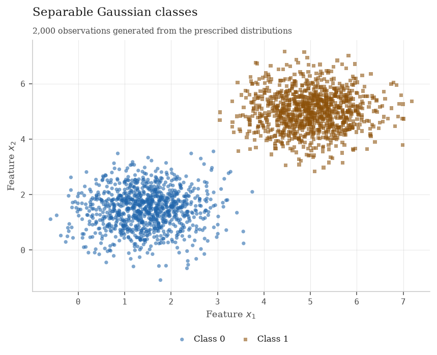
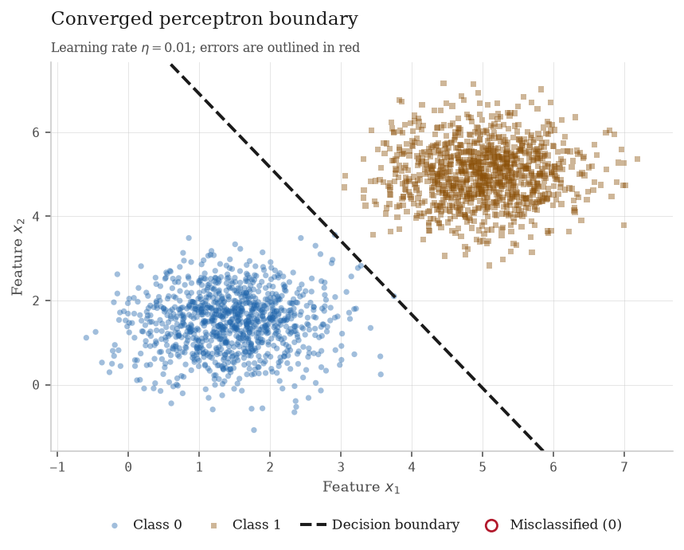
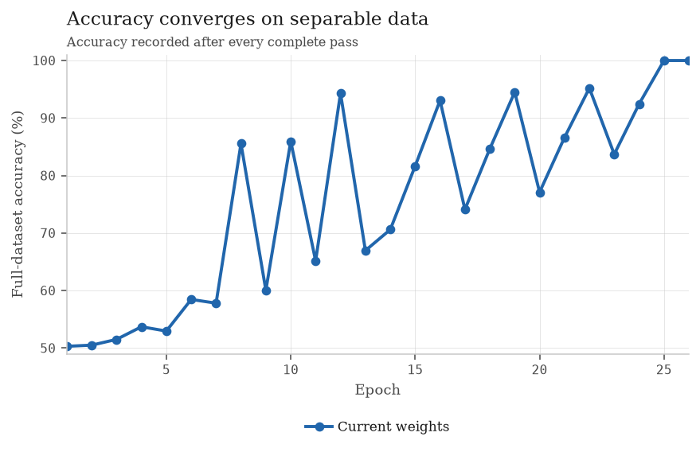
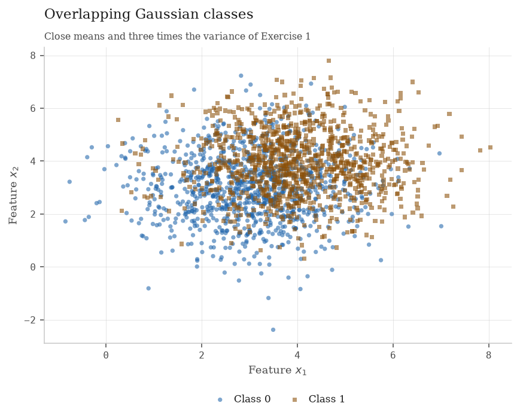
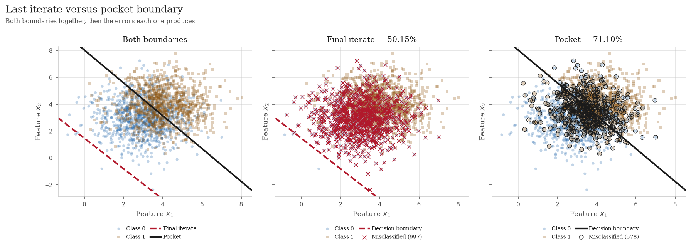
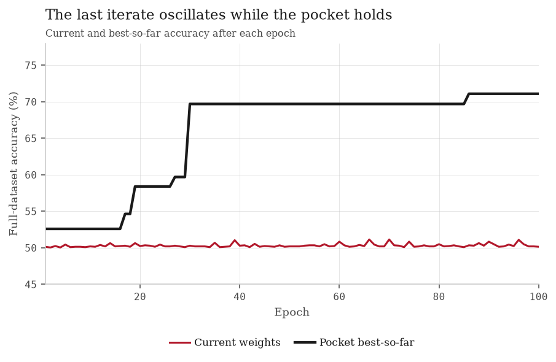

# Activity 2 — Perceptron

Insper · Artificial Neural Networks and Deep Learning · Individual

The same hand-written perceptron behaves in two radically different ways. On
separable data it eventually makes a complete pass with no errors and stops. On
overlapping data its last iterate is nearly a one-class rule, even though an
earlier iterate gave a much better linear boundary. Keeping that earlier state
is the purpose of the pocket algorithm.

  
Exercise 1 accuracy100.00%

  
Exercise 1 epochs26

  
Exercise 2 final50.15%

  
Exercise 2 pocket71.10%

!!! info "Reproducibility"
    The entry point creates exactly one generator,
    `rng = np.random.default_rng(42)`, and passes it through Exercise 1 and then
    Exercise 2. Thus Exercise 2's draws depend on Exercise 1 having run first.
    The two learning-rate runs in Exercise 1 use the same data and the same
    initial weights; the second run consumes no additional random numbers.
    Running `python docs/exercises/perceptron/code/run_report.py` regenerates all
    figures, the summary table and `results.json`. Only NumPy and Matplotlib are
    used; the activation, prediction, update rule and loop are implemented from
    scratch.

---

## Exercise 1 — Separable data

### A — Generate the data

I generated 1,000 two-dimensional observations per class. Class 0 follows

\[
\mathcal{N}\!\left(
\begin{bmatrix}1.5\\1.5\end{bmatrix},
\begin{bmatrix}0.5&0\\0&0.5\end{bmatrix}\right),
\]

and class 1 has the same covariance and mean \([5,5]^T\). The points remain in
generation order (class 0 followed by class 1); no shuffling is introduced by
the training loop.

<figure markdown="span">
  
  <figcaption>Figure 1 — The 2,000 observations in the separable dataset. Colour and marker shape both encode class.</figcaption>
</figure>

### B — Implement the perceptron

The model predicts

\[
\hat y = \operatorname{step}(\mathbf{w}\!\cdot\!\mathbf{x}+b),
\qquad
\operatorname{step}(z)=\begin{cases}1,&z\geq0\\0,&z<0.\end{cases}
\]

The equality case therefore belongs to class 1. For each sample, the code then
applies the 0/1-label update

\[
\mathbf{w}\leftarrow\mathbf{w}+\eta(y-\hat y)\mathbf{x},
\qquad
b\leftarrow b+\eta(y-\hat y).
\]

This error term matters: a false positive from class 0 has \(y-\hat y=-1\), so
it correctly moves both parameters in the negative direction. The alternative
textbook expression \(\eta y\mathbf{x}\), which assumes labels \(-1,+1\), would
never correct a class-0 mistake here.

The initial state is \(\mathbf{w}_0=[0.002532,\,0.008952]\), drawn from
\(\mathcal{N}(0,0.01^2)\), and \(b_0=0\). Training uses \(\eta=0.01\), records
full-dataset accuracy after every epoch, and stops after an epoch with zero
updates or after 100 epochs. The complete shared implementation is shown on the
[code page](code.md).

### C — Train and measure

With \(\eta=0.01\), the final parameters are
\(\mathbf{w}=[0.050497,\,0.028872]\) and \(b=-0.250000\). The model converged in
**26 epochs** with final accuracy **100.00%** (2,000 of 2,000 points). Epoch 25
first reached perfect accuracy; epoch 26 confirmed convergence with no update.

<figure markdown="span">
  
  <figcaption>Figure 2 — Decision boundary after convergence. The misclassification layer is empty because final accuracy is 100%.</figcaption>
</figure>

<figure markdown="span">
  
  <figcaption>Figure 3 — Accuracy after each complete pass. Online updates make the curve non-monotone, but the final update-free pass remains at 100%.</figcaption>
</figure>

### D — Analysis

#### Why the separable case converges

Each error changes the boundary in the direction that corrects that sample;
correct predictions make no change. The actual update counts by epoch were

`3, 3, 4, 4, 3, 4, 3, 4, 2, 4, 2, 4, 2, 3, 3, 3, 2, 3, 3, 2, 3, 3, 2, 3, 1, 0`.

The counts need not decrease monotonically: fixing one point can temporarily
break another. Their envelope nevertheless contracts, from passes with up to
four corrections to one final correction and then zero. Because a separating
line with positive margin exists, the perceptron convergence theorem guarantees
only finitely many mistakes; the zero-update epoch is both the numerical evidence
and the stopping condition.

#### Re-running with \(\eta=1.0\)

To isolate learning rate, I held both the dataset and
\(\mathbf{w}_0=[0.002532,0.008952]\) fixed. The \(\eta=1.0\) run also obtained
**100.00%**, in **37 epochs**, ending at
\(\mathbf{w}=[5.870616,3.359239]\), \(b=-31.000000\). The unit normal vectors are

\[
\frac{\mathbf{w}_{0.01}}{\lVert\mathbf{w}_{0.01}\rVert}
 =[0.868123,0.496349],\qquad
\frac{\mathbf{w}_{1.0}}{\lVert\mathbf{w}_{1.0}\rVert}
 =[0.867950,0.496652].
\]

Their cosine is **0.99999994**, or an angle of **0.01998°**. Thus this seeded run
happened to find almost parallel normals, but not the same boundary: the signed
offset magnitudes \(-b/\lVert\mathbf{w}\rVert\) are approximately **4.297** and
**4.583**, respectively. Learning rate controls the size of every correction,
not the final accuracy guarantee. At \(\eta=0.01\), early changes
\(\eta\mathbf{x}\) are comparable with the approximately 0.01 initialization;
at \(\eta=1\), one mistake overwhelms it and the early mistaken samples dominate
the trajectory. The numerical near-alignment here is an outcome of this dataset,
not evidence that the two parameter trajectories are identical.

#### Why a zero start would erase this comparison

Starting instead from \(\mathbf{w}=\mathbf{0}\), \(b=0\), after \(k\) updates

\[
\mathbf{w}^{(k)}_\eta=\eta\sum_{i=1}^{k} e_i\mathbf{x}_i,
\qquad
b^{(k)}_\eta=\eta\sum_{i=1}^{k}e_i,
\qquad e_i=y_i-\hat y_i.
\]

Assume two positive learning rates have made the same mistakes through update
\(k\). Their states then differ only by the positive factor
\(\eta_2/\eta_1\). Positive scaling leaves the sign of
\(\mathbf{w}\cdot\mathbf{x}+b\) unchanged, so the next prediction, error and
updated sample are also the same. By induction,
\((\mathbf{w}_{\eta_2},b_{\eta_2})=(\eta_2/\eta_1)
(\mathbf{w}_{\eta_1},b_{\eta_1})\) at every step. The boundary, mistakes and
epoch count are identical; only parameter scale changes. This is why the
prescribed non-zero initialization is essential.

---

## Exercise 2 — Overlapping data

### A — Generate the data

Again there are 1,000 points per class, but now class means are \([3,3]^T\) and
\([4,4]^T\), both with covariance
\(\begin{bmatrix}1.5&0\\0&1.5\end{bmatrix}\). The centroid of the realized
dataset is \([3.526414,3.473506]^T\). Close means and larger variance make the
two generating distributions overlap, so no line can classify every sample.

<figure markdown="span">
  
  <figcaption>Figure 4 — The overlapping dataset. Class identity is again encoded by both colour and marker.</figcaption>
</figure>

### B — Train, keeping the best weights

I reused the **same `Perceptron.fit` implementation unchanged**, with
\(\eta=0.01\), the 100-epoch limit and initial weights
\([0.012158,-0.004510]\). Since no error-free pass exists, it completed all
**100 epochs** and made 289 updates.

The last iterate is \(\mathbf{w}=[0.054484,0.048043]\), \(b=-0.070000\), with
accuracy **50.15%**. The pocket iterate is
\(\mathbf{w}_{p}=[0.010664,0.008727]\), \(b_p=-0.070000\), with accuracy
**71.10%**. Pocket accuracy is evaluated after every mistake-driven update and
copied only on a strict improvement, rather than being sampled merely at epoch
boundaries. Its best state appeared on **epoch 86**, after the 247th update.

### C — Figures

<figure markdown="span">
  
  <figcaption>Figure 5 — The left panel carries both learned boundaries over the data. The other two separate the error sets, which overlap too heavily to read on one axes: red crosses mark final-iterate errors, black rings mark pocket errors.</figcaption>
</figure>

<figure markdown="span">
  
  <figcaption>Figure 6 — The last-iterate accuracy keeps oscillating near 50%, while the pocket curve can only rise and holds its best observed value.</figcaption>
</figure>

### D — Analysis

#### Why final and pocket accuracy differ

For these observations the mean \(\lVert\mathbf{x}\rVert\) is **5.1108**. One
mistake therefore moves the bias by exactly \(\eta=0.01\), while its typical
weight-vector move has magnitude
\(\eta\lVert\mathbf{x}\rVert\approx\mathbf{0.0511}\), about five times larger.
The bias cannot adjust the boundary offset as quickly as the normal vector moves.

The final numbers verify the consequence. Its weight norm is
\(\lVert\mathbf{w}\rVert=\mathbf{0.07264}\), while \(b=-0.07000\). The dataset
centroid is **3.97865 units** from the final boundary, far into its positive
half-plane; the model predicts class 1 for **1,997 of 2,000 points** and class 0
for only 3. That almost-all-one-class rule necessarily lands near the balanced
dataset's 50% baseline.

Sample order contributes to *how* extreme the endpoint is, and the contribution
is measurable. Class-0 points are visited first and class-1 points last, so each
pass ends having just corrected a run of class-1 mistakes, leaving the iterate
tilted towards class 1 exactly when accuracy is recorded. Re-running the
identical data, initialization, \(\eta\) and epoch cap with the two classes
strictly alternated instead moves the final iterate to **68.40%** and raises the
update count from 289 to **98,296**. The failure itself does not go away — that
run still never settles, and its last iterate still ends below its own pocket of
**71.90%** — but the 50.15% figure is specifically a product of the blocked
visiting order. In neither ordering does the loop possess a mechanism that
prefers a globally good line; it only ever reacts to the sample in front of it.

The pocket caught a much more central line: its weight norm is **0.01378**, its
centroid distance is only **0.15115**, and its predictions split into **1,088
class 0** and **912 class 1**.

Its 71.10% is close to the ceiling, and the ceiling can be stated exactly rather
than asserted. For two Gaussians sharing covariance \(\sigma^2 I\) and equal
priors, the optimal linear rule cuts perpendicular to the line joining the
means, where the classes project to normals separated by
\(d=\lVert\boldsymbol\mu_1-\boldsymbol\mu_0\rVert=\sqrt2\) with
\(\sigma=\sqrt{1.5}\); its accuracy is
\(\Phi\!\left(d/2\sigma\right)=\mathbf{71.81\%}\). Sweeping all directions and
all thresholds on the realized sample gives a best attainable **71.90%**. The
pocket therefore sits **0.80 percentage points** below the best line that
exists, while the last iterate sits more than 21 points below it.

#### Figure 3 versus Figure 6

In Figure 3 the finite sequence of corrections ends with an update-free pass;
accuracy settles at 100%. In Figure 6 the current iterate never settles: its
end-of-epoch accuracy ranges from **50.05% to 51.15%** after the first epoch,
even while transient within-epoch iterates let the pocket rise to 71.10%.

The perceptron convergence theorem guarantees a finite number of updates only
when the training data are linearly separable with a positive margin. Exercise 2
violates exactly that assumption: points from the two labels occupy overlapping
regions, so every straight boundary leaves at least one error.

#### More epochs and smaller learning rates

More epochs do not fix the last iterate. There is always another misclassified
point, so another correction occurs, and the loop has no loss minimization or
“good enough” stopping rule that could make it retain a useful state. It merely
continues moving among incompatible constraints.

A smaller positive \(\eta\) also does not repair the underlying behavior. It
rescales both updates,
\(\Delta b=\eta e\) and
\(\lVert\Delta\mathbf{w}\rVert=\eta\lVert\mathbf{x}\rVert\), by the same factor;
their approximately 1:5 imbalance remains. Once the small initialization is
negligible (and exactly for a zero start), scaling \(\eta\) scales the parameter
trajectory without changing its predictions and mistakes. It changes how large
the steps look, not the absence of a separating solution. What helps is precisely
the pocket rule: retain the best observed iterate instead of returning the last.

---

## Results summary

--8<-- "results/perceptron/tbl_summary.md"
